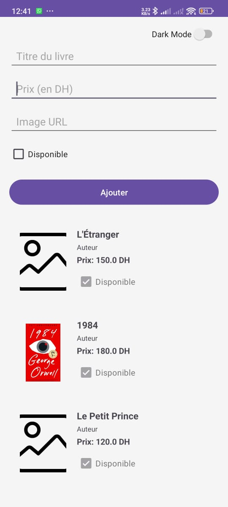
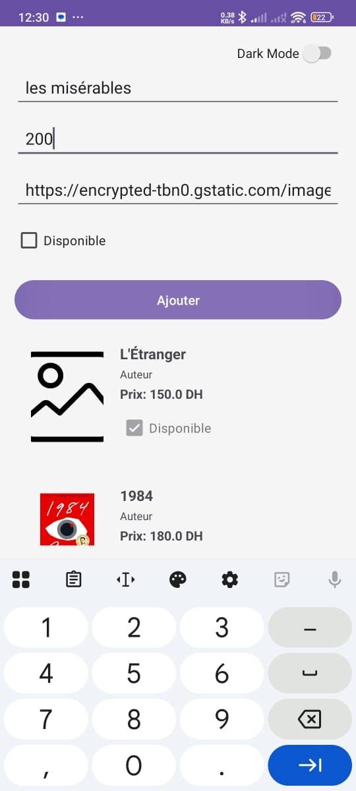
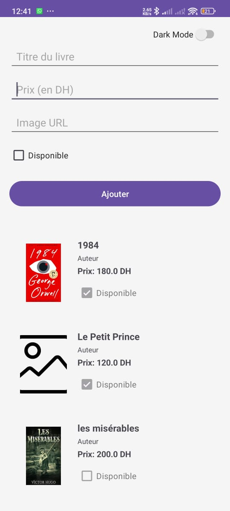
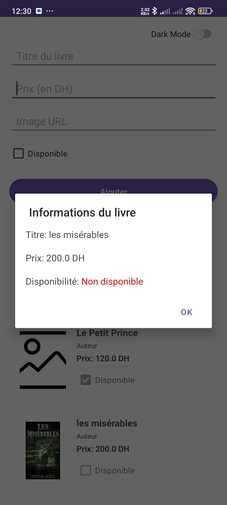

# Application de Gestion de Bibliothèque

## Description
Application Android développée en Kotlin pour gérer une bibliothèque en ligne. Ce projet a été réalisé dans le cadre du TP N°6 du module Développement Android.

## Fonctionnalités
- Affichage d'une liste de livres avec RecyclerView
- Ajout de nouveaux livres via un formulaire
- Validation des données (champs obligatoires, prix > 0)
- Chargement d'images depuis URL avec Glide
- Affichage des détails d'un livre dans une boîte de dialogue
- Indication visuelle de la disponibilité (vert/rouge)

## Technologies utilisées
- **Langage** : Kotlin
- **UI** : RecyclerView, AlertDialog
- **Bibliothèques** : Glide pour le chargement d'images
- **Architecture** : Adapter personnalisé avec ViewHolder

## Structure du projet
- `Livre.kt` - Classe de données
- `AdapterLivres.kt` - Adapter pour le RecyclerView
- `MainActivity.kt` - Activité principale
- `activity_main.xml` - Layout principal
- `livre_item.xml` - Layout d'un item de livre

## Installation
1. Cloner le repository
2. Ouvrir le projet dans Android Studio
3. Synchroniser Gradle
4. Lancer l'application sur un émulateur ou appareil physique

## Captures d'écran

   

## Auteur
**KARIM**

## Date
2025/2026
